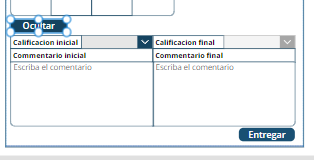

# Admin screen Jefe

[[_TOC_]]


## Descripción 

En esta pantalla se hizo una interfaz diseñada exclusivamente para supervisores o jefes de equipos de colaboradores. Solo aquellos encargados de  colaboradores tienen acceso a esta pantalla, que se encuentra en la sección "HomeScreenNew". Permite filtrar las revisiones de rendimiento por fecha, visualizar resultados, agregar objetivos y acceder a información relevante a través de galerías interactivas. Es una herramienta poderosa para la gestión eficiente y efectiva de colaboradores, mejorando la comunicación y facilitando la toma de decisiones informadas.

**Disclaimer**: Puesto que el usuario que se esta utilizando no es jefe de nadie (el desarrollador), se utilizó el nombre del Jefe "Francisco Moralejo Giono" en el filter del [Gallery-EmpleadosPR](#gallery-empleados_pr) para poder visualizar la información. 


## Componentes

<ul>

### Date Pickers de los PR


Estos _DP_ se usan para poder seleccionar el periodo en el que se estará evaluando la calificación de los colaboradores. El gallery que se muestra a continuación está condicionado por estos componentes.

</ul>


<br>
<ul>

### Gallery Empleados_PR
<br>
Este Gallery está condicionado de por la siguiente propiedad `Items`.

```cpp
Filter(
    PerformanceReview,
    // Cambiar esto a  
    Jefe = Text(User().FullName)
    And
    DP_Inicio.SelectedDate  <= DateValue(Text(DateValue(Preiodo_Ev_Inicio),"dd/mm/yyyy"))
    And
    DP_Final.SelectedDate >= DateValue(Text(DateValue(Periodo_Ev_Fin),"dd/mm/yyyy"))
)
```


Como se puede observar en el código, se hace un `Filter` de la tabla `PerformanceReview`, en la cual solo se regresan aquellas filas las cuales cumplan con las siguientes condiciones `AND` :

- Campo Jefe es igual al nombre de usuario de la persona que está utilizando la Aplicación.
- La fecha de inicio del periodo esta dentro o es igual a la fecha seleccionada en el `DatePicker` correspondiente.
- La fecha de fin del periodo esta dentro o es igual a la fecha seleccionada en el `DatePicker` correspondiente.

<br>

### Boton de valores

<br>

Este boton hace visibles los elementos correspondientes con un cambio de variables de `False` a `True` en su propiedad `OnSelect`, también le quita visibilidad a otros componentes pues estos corresponden a otros botones. 

```cpp
Set(View_Values, true);
Set(View_Objectives, false);
Set(bossIsCreatingObjective,false);
Set(selected_user, Text(Email_check.Text));
```

Como podemos observar la variable `selected_user` está también se setea durante este proceso, esto para proveerle información a otros componentes acerca del colaborador que se quiere calificar.

<br>

### Botón de Objetivos
<br>

Este boton hace visibles los elementos correspondientes con un cambio de variables de `False` a `True` en su propiedad `OnSelect`, también le quita visibilidad a otros componentes pues estos corresponden a otros botones. 

```cpp
Set(View_Values, false);
Set(bossIsCreatingObjective,false);
Set(View_Objectives, true);
Set(selected_user, Text(Email_check.Text));
```

Como podemos observar la variable `selected_user` está también se setea durante este proceso, esto para proveerle información a otros componentes acerca del colaborador que se quiere calificar.


### Botón de Resultados

Este botón tiene en su propiedad `OnSelect` setear las variables `selected_user` , `selected_user_ID_Results` , y `bossIsCreatingObjective` como se ve a continuación:

```cpp
Set(selected_user, Text(Email_check.Text));
Set(selected_user_ID_Results, ThisItem.PR_ID);
Set(bossIsCreatingObjective,false);
Refresh(PerfReview_Objectives);
Refresh(PerfReview_Valores);
Refresh(PerformanceReview);
Navigate('Resultados new')
```

Posteriormente, podemos observar que el botón Refresca la información que obtiene de las tablas y se navega a la pantalla [Resultados New](./Resultados%20new.md).

### Apartado de Valores


Para que se pueda visualizar la información de cada valor se debe de seleccionar el valor en el Dropdown `DD_Select_Val_Jefe`. Para que el usuario jefe pueda estar seguro del usuario que se está calificando puede observar que el label `Label22` que muestra el correo del usuario.

El dropdown tiene los siguientes campos en su propiedad `Items`:


Este apartado se compone de varios elementos estos elementos son labels, botones y dropdowns, los cuales tienen condicionada la visibilidad por el respectivo botón de valores. Se muestran varios campos de la tabla de valores, estos siendo filtrados por la variable `selected_user` al ser presionada en el botón [boton-valores](#boton-de-valores).
Al presionar el botón calificar se activan los valores se setea la variable se ejecuta el siguiente código en la propiedad `OnSelect`:

```cpp
If(isRating = true,Set(isRating,false), Set(isRating,true));
Set(CalificacionJefeInit, If(ThisItem.CalificacionJefe = Blank() Or ThisItem.CalificacionJefe = "", "", ThisItem.CalificacionJefe));
Set(CalificacionJefeFin, If(ThisItem.CalificacionJefeFin = Blank() Or ThisItem.CalificacionJefeFin = "", "",ThisItem.CalificacionJefeFin));
Set(CommentJefeInit, If(ThisItem.ComentarioJefe = Blank() Or ThisItem.ComentarioJefe = "", "",ThisItem.ComentarioJefe));
Set(CommentJefeFin , If(ThisItem.ComentarioJefeFin = Blank() Or ThisItem.ComentarioJefeFin = "","",ThisItem.ComentarioJefeFin));
Reset(DD_Boss_rate_init);
Reset(DD_Boss_rate_final);
Reset(Comment_boss_initial);
Reset(Comment_boss_final);
```

En este código se setea la variable `IsRating` a `true` si está en `false` y viceversa. Todos los campos a calificar se quedan en blanco si por si el usuario había llenado otro valor con datos agenos y no tenga que borrarlos y escribir nuevamente.

En este apartado si los datos ya se calificaron y están guardados en la base de datos , no se podrá modificar la calificación nuevamente, y aparecerá deshabilitada.



El jefe en esta pantalla puede seleccionar la calificación del valor inicial y final e incluso poner un comentario respectivo, está la opción de quedar vacío.

<br>

</ul>


<ul>

### Apartado de Objetivos


Al presionar el botón de objetivos podemos visualizar este conjunto de elementos , los cuales incluyen labels/botones en donde se pueden añadir, aprobar y rechazar objetivos. Se pueden ver varios de los campos de la tabla objetivos con respecto al respectivo indicador de negocio. Una vez el objetivo se ha aceptado o rechazado, ya no puede ser editado por el colaborador o eliminado por el jefe o colaborador.

El jefe unicamente puede aprobar el objetivo o rechazarlo si el colaborador ya cerró el objetivo, esto se debe a que no se le debe permitir al colaborador editar el objetivo una vez lo cerró, para que no lo edite una vez aprobado por el jefe.


</ul>